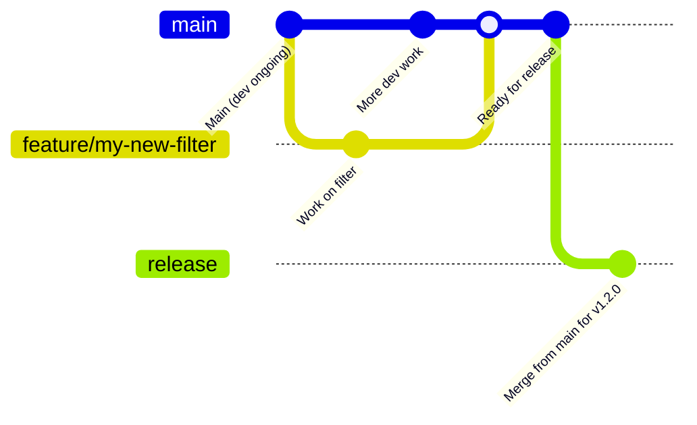
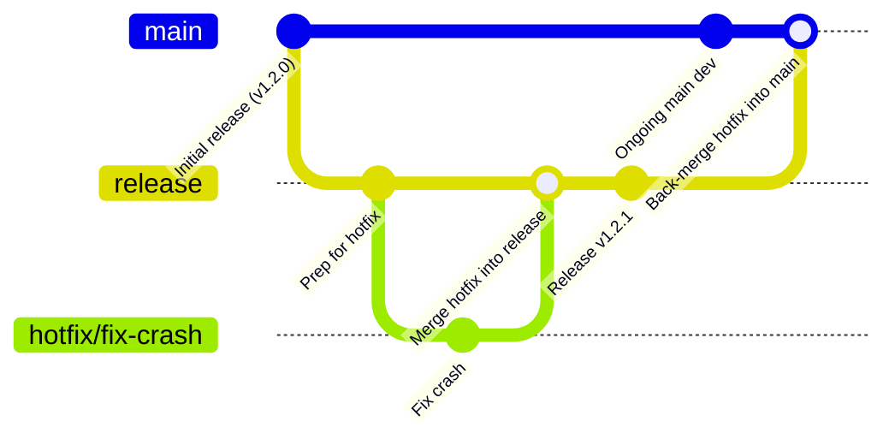

# Contributing to the OCR Filter

Thanks for your interest in improving the **OCR Filter**, a configurable optical character recognition component built on top of OpenFilter! 🕵️
Whether you're fixing bugs, optimizing performance, adding support for new OCR models, or improving documentation, your help makes a difference.

This guide will help you:

* Set up your local development environment
* Run and write tests
* Use the OCR Filter with OpenFilter CLI
* Understand our pull request and commit conventions
* Sign your commits (Developer Certificate of Origin)
* Get in touch with maintainers

---

## Topics

* [Contributing to the OCR Filter](#contributing-to-the-ocr-filter)

  * [Setting up your development environment](#setting-up-your-development-environment)
  * [Running tests](#running-tests)
  * [Running with the OpenFilter CLI](#running-with-the-openfilter-cli)
  * [Reporting issues](#reporting-issues)
  * [Contribution guidelines](#contribution-guidelines)

    * [Pull request process](#pull-request-process)
    * [Commit message format](#commit-message-format)
    * [Sign your commits (DCO)](#sign-your-commits-dco)
  * [Style and conventions](#style-and-conventions)
  * [Release process](#release-process)
  * [Thank you](#thank-you-)

---

## Setting up your development environment

The OCR Filter is a Python package that depends on [OpenFilter](https://github.com/PlainsightAI/openfilter).

To get started:

```bash
git clone git@github.com:PlainsightAI/filter-optical-character-recognition.git
cd filter-optical-character-recognition
# Optional but recommended:
python -m venv venv && source venv/bin/activate
make install
```

This installs the OCR Filter and its dependencies.

You can also install the latest release directly from PyPI:

```bash
pip install filter-optical-character-recognition
```

### Quick test

You can run the filter with:

```python
from filter_optical_character_recognition.filter import FilterOpticalCharacterRecognition

if __name__ == "__main__":
    FilterOpticalCharacterRecognition.run()
```

Or as part of a larger pipeline via `Filter.run_multi()`.

---

## Running tests

Unit tests for the OCR Filter live in the `tests/` directory. To run:

```bash
make test
```

To include coverage reports:

```bash
make test-coverage
```

Make sure all tests pass before submitting a PR. If you modify `process()` logic or visualization, update tests accordingly.

---

## Running with the OpenFilter CLI

You can run the OCR Filter on video using the OpenFilter CLI:

```bash
openfilter run \
  - VideoIn --sources 'file://video_example.mp4!loop' \
  - filter_optical_character_recognition.filter.FilterOpticalCharacterRecognition \
      --ocr_engine easyocr \
      --forward_ocr_texts true \
      --draw_visualization true \
      --visualization_topic "main" \
      --visualization_resize_factor 1.0 \
      --topic_pattern "main" \
  - Webvis
```

Or use the Makefile:

```bash
make run
```

You can configure various options using environment variables or CLI flags (e.g., `--ocr_language`, `--output_json_path`).

**Note:** The filter defaults to EasyOCR. You can switch to Tesseract using `--ocr_engine tesseract`. Ensure the Tesseract binary is available and correctly configured.

---

## Reporting issues

Found a problem with bounding boxes? Inconsistent OCR output? Bad config behavior?

Please [open an issue](https://github.com/PlainsightAI/filter-optical-character-recognition/issues) with:

* A description of what you're trying to do
* What went wrong
* Input or config snippet (if possible)
* Stack trace or logs (if applicable)

Reproducible examples help a lot!

---

## Contribution guidelines

### Pull request process

* Branch off `main` (e.g. `feature/improve-viz`, `fix/tesseract-path`)
* Keep your change focused and atomic
* Run tests before pushing
* Update documentation if you change behavior
* Sign your commits (see below)
* Submit PR to `main`

### Commit message format

Follow this format:

```
Short summary (max 50 characters)

Optional detailed body.
Closes #123 if applicable.
```

Use `-s` to sign your commits (see below).

### Sign your commits (DCO)

All commits must be signed using the Developer Certificate of Origin:

```bash
git commit -s -m "Fix JSON output encoding"
```

Which adds:

```
Signed-off-by: Your Name <your.email@example.com>
```

Unsigned commits will be rejected by CI.

Learn more: [developercertificate.org](https://developercertificate.org)

---

## Style and conventions

* Use `black` for code formatting
* Use `ruff` for linting
* Type-hint all function signatures in `filter.py`
* Add docstrings for all config fields and key methods
* Keep logic simple and explicit
* Use `logger.debug/info` for internal traces, not `print()`
* Avoid silent failures — raise `ValueError` or `TypeError` with useful messages

---

## Release Process

OpenFilter uses a structured release workflow to ensure stability, transparency, and traceability of code changes.

Whether you're contributing a quick fix or a large feature, it's important to understand how changes move from your local branch into production.

### 🧵 Development Flow

- All contributors (including maintainers) **branch off of `main`** for any feature, bugfix, or documentation update.
- Pull requests should always **target `main`**, which serves as the active development branch.
- Once PRs are approved and merged into `main`, they are queued for inclusion in the next release.

> 🔒 **Important:** Only **core maintainers** are allowed to merge `main` into `release`. This ensures all published versions are stable, reviewed, and correctly documented.

### 🛠️ Releasing

- Releases are **cut from the `release` branch**, which always reflects the **latest stable version** of OpenFilter.
- To merge from `main` into `release`, the following must be true:
  - The `RELEASE.md` file contains an accurate and up-to-date changelog entry for the version.
  - The `VERSION` file matches the version declared in `RELEASE.md`.

> This guards against accidental or incomplete releases and ensures that the changelog is always reliable.

Once merged, the release automation tags the version, pushes a GitHub release, publishes documentation, and optionally builds artifacts (e.g., Docker images, Python wheels).

### 🧯 Hotfixes

Occasionally, an urgent fix may need to be deployed without waiting for the next full release cycle.

- In these cases, hotfix branches are **cut from the `release` branch**, not `main`.
- Once the fix is ready, it's:
  1. Merged back into `release`
  2. Then merged **forward into `main`** to ensure future releases retain the hotfix.

This guarantees the stability of released versions without introducing unreviewed changes from `main`.

---

### 🔄 Diagram: Standard Release Flow



### 🚑 Diagram: Hotfix Flow



---

## Thank you 🙏

Thanks for helping improve the OCR Filter! Contributions, feedback, and ideas are always welcome.

Whether you're contributing a bug fix, a test case, a feature, or just reviewing a PR — we appreciate you.

Come join us in building better OCR tooling for real-world applications!
